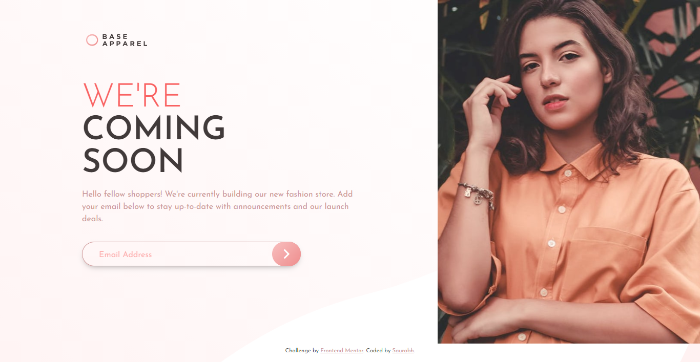
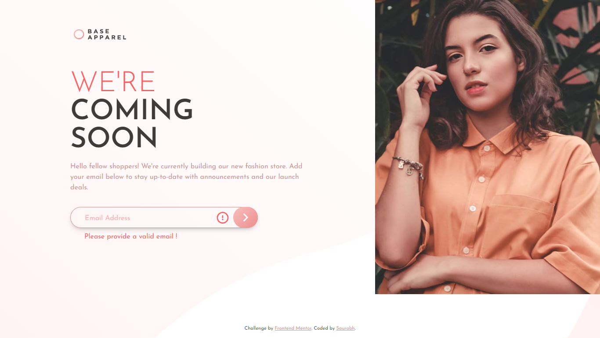
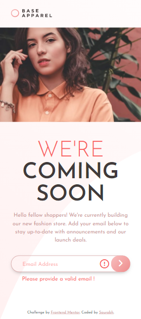

# Frontend Mentor - Base Apparel coming soon page solution

This is a solution to the [Base Apparel coming soon page challenge on Frontend Mentor](https://www.frontendmentor.io/challenges/base-apparel-coming-soon-page-5d46b47f8db8a7063f9331a0). Frontend Mentor challenges help you improve your coding skills by building realistic projects.

## Table of contents

- [Overview](#overview)
  - [The challenge](#the-challenge)
  - [Screenshot](#screenshot)
  - [Links](#links)
- [My process](#my-process)
  - [Built with](#built-with)
  - [What I learned](#what-i-learned)
  - [Continued development](#continued-development)
  - [Useful resources](#useful-resources)
- [Author](#author)
- [Acknowledgments](#acknowledgments)

## Overview

### The challenge

Users should be able to:

- View the optimal layout for the site depending on their device's screen size
- See hover states for all interactive elements on the page
- Receive an error message when the `form` is submitted if:
  - The `input` field is empty
  - The email address is not formatted correctly

### Screenshot

#### Desktop



#### Desktop-active



#### Mobile



### Links

- Solution URL: [Solution](https://your-solution-url.com)
- Live Site URL: [Live Site](https://your-live-site-url.com)

## My process

### Built with

- Semantic HTML5 markup
- Mobile-first workflow
- SASS
- Flexbox

### What I learned

I was able to look into the regular expression for validating the email which has been really helpful while submitting the form. It'll be of greate use as current website isn't completed without a login page.

```js
function validateEmail(inputText) {
  var mailformat =
    /^[a-zA-Z0-9.!#$%&'*+/=?^_`{|}~-]+@[a-zA-Z0-9-]+(?:\.[a-zA-Z0-9-]+)*$/;
  const icon = document.querySelector(".icon");
  const error = document.querySelector(".error");
  const email = document.getElementById("email");
  if (inputText.value.match(mailformat)) {
    document.form.email.focus();
    return true;
  } else {
    icon.classList.toggle("active");
    error.classList.toggle("active");
    document.form.email.focus();
    return false;
  }
}
```

### Continued development

I'll be focusing more on the JavaScript functionality section all along with challenging CSS Styles. Will also be researching on animate-out so that once implemented will be even cooler.

### Useful resources

- [W3 Schools](https://www.w3schools.com/) - This has been my first line of contact when I was stuck at stages. It usually solved all my quests.

## Author

- Frontend Mentor - [@saurabh1996-rex](https://www.frontendmentor.io/profile/saurabh1996-rex)

## Acknowledgments

Always thankful to Frontendmentor.io as they've provided all the necessary files so that it was easier to work with the project. Also special metion to the one who have designed this project, Great Work!
